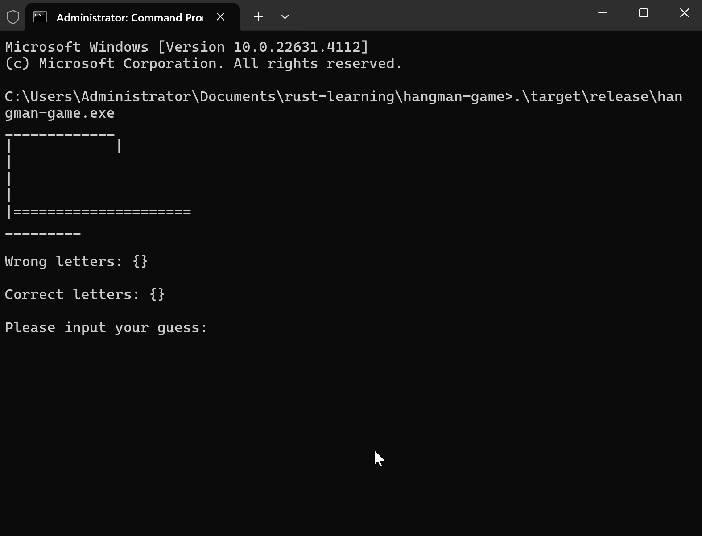

# Jogo da Forca (versão com funções)

## Descrição

Réplica do projeto [jogo da forca (versão simplificada)](../hangman-game/README.md), mas com a adição de funções para melhorar a legibilidade e organização do código.

## Objetivo

O objetivo deste projeto é refatorar o código da versão simplificada aderindo ao uso de funções para melhorar a legibilidade do código.


## Como jogar

Caso queira compilar o projeto e rodá-lo, é necessário ter o Rust instalado. As instruções para instalação do Rust podem ser encontradas [neste link](https://doc.rust-lang.org/book/ch01-01-installation.html#installing-rustup-on-linux-or-macos). 

Comando para rodar o projeto a partir da pasta raiz do repositório:
```bash
cargo run hangman-game-function
```

## Exemplo de execução



## Notas

Para fins didáticos, o projeto foi refatorado para adicionar funções e melhorar a organização do código. No entanto, ainda não foram implementadas funcionalidades mais avançadas, como o uso de `struct` e `enum` para representar os dados do jogo de forma mais estruturada, equivalente à programação orientada a objetos.