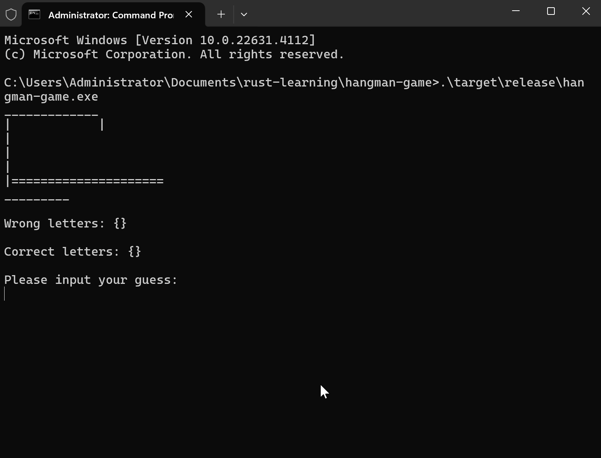

# Jogo da Forca (versão simplificada)

## Descrição

Este projeto é um jogo da forca implementado em Rust. Há uma lista de palavras pré-definidas no arquivo `words.txt` presente na pasta deste projeto, e o jogo escolhe uma palavra aleatória para o jogador adivinhar. O jogador tem 6 tentativas para adivinhar a palavra, e a cada tentativa, o jogo exibe a palavra com as letras certas à mostra, e também todas as letras certas e erradas já jogadas. Se o jogador adivinhar a palavra, ele vence o jogo. Se o jogador errar 6 vezes, ele perde o jogo.

## Objetivo

O objetivo deste projeto é praticar a linguagem Rust, cobrindo conceitos fundamentais da linguagem, como:
- Manipulação de variáveis e seus tipos (`i32`, `usize`, `str`, `String`, `char`, `bool`)
- Leitura de arquivos com a biblioteca padrão `std::fs`
- Uso de coleções `HashMap`
- Controle de fluxo (loops e condicionais)
- Entrada e saída (I/O) para leitura de dados do usuário com a biblioteca padrão `std::io`
- Gerenciamento de erros
- Uso de bibliotecas externas, em específico a biblioteca `rand` para escolher uma palavra aleatória dentre as palavras do arquivo.

## Como jogar

Caso queira compilar o projeto e rodá-lo, é necessário ter o Rust instalado. As instruções para instalação do Rust podem ser encontradas [neste link](https://doc.rust-lang.org/book/ch01-01-installation.html#installing-rustup-on-linux-or-macos). 

Comando para rodar o projeto a partir da pasta raiz do repositório:
```bash
cargo run hangman-game
```

## Exemplo de execução



## Notas

Como este projeto é uma versão simplificada do jogo da forca, não foram implementadas funcionalidades mais avançadas, como:
- Uso de funções para melhorar a legibilidade e organização do código
- Uso de `struct` e `enum` para representar os dados do jogo de forma mais estruturada, equivalente à programação orientada a objetos